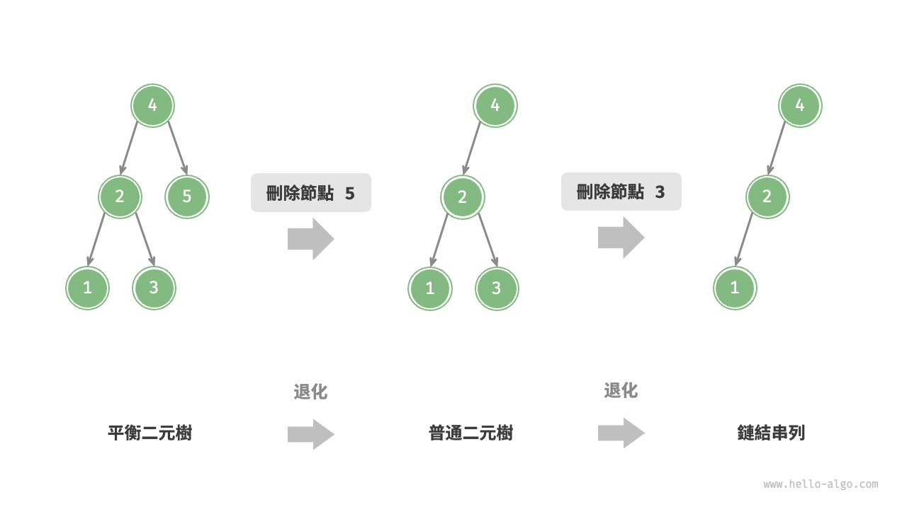

# AVL樹
在“二元搜尋樹”章節中我們提到，**在多次插入和刪除操作後**，
二元搜尋樹可能退化為鏈結串列。在這種情況下，所有操作的時間複雜度將從O(log n)
劣化為O(n) 
。

如圖 7-24 所示，經過兩次刪除節點操作，這棵二元搜尋樹便會退化為鏈結串列。

1962 年 G. M. Adelson-Velsky 和 E. M. Landis 在論文“An algorithm for the organization of information”中提出了 AVL 樹。
論文中詳細描述了一系列操作，**確保在持續新增和刪除節點後，AVL 樹不會退化**，
從而使得各種操作的時間複雜度保持在O(log n)級別。
換句話說，在需要**頻繁進行增刪查改操作的場景中**，AVL 樹能始終保持高效的資料操作效能，具有很好的應用價值。

---
## AVL樹常見術語
AVL 是binary search tree ,也是平衡二元樹,同時滿足這兩類二元樹的所有性質,
所以是一種 平衡二元搜尋樹(balanced binary search tree)

1. 節點高度(height):該節點到最遠”葉節點“的距離,即所經過的"邊"的數量,葉節點的高度是0,而空節點的高度是-1
2. 節點平衡因子(balance factor):定義為節點左子樹的高度 - 右子樹的高度,同時規定空節點的平衡因子為0

---
## AVL樹旋轉
AVL 樹的特點在於 **“旋轉”**操作，它能夠在**不影響二元樹的中序走訪序列**的前提下，使失衡節點重新恢復平衡。換句話說，旋轉操作既能保持“二元搜尋樹”的性質，也能使樹重新變為“平衡二元樹”。

我們將平衡因子絕對值
的節點稱為“失衡節點”。根據節點失衡情況的不同，旋轉操作分為四種：右旋、左旋、先右旋後左旋、先左旋後右旋。

### 右旋

